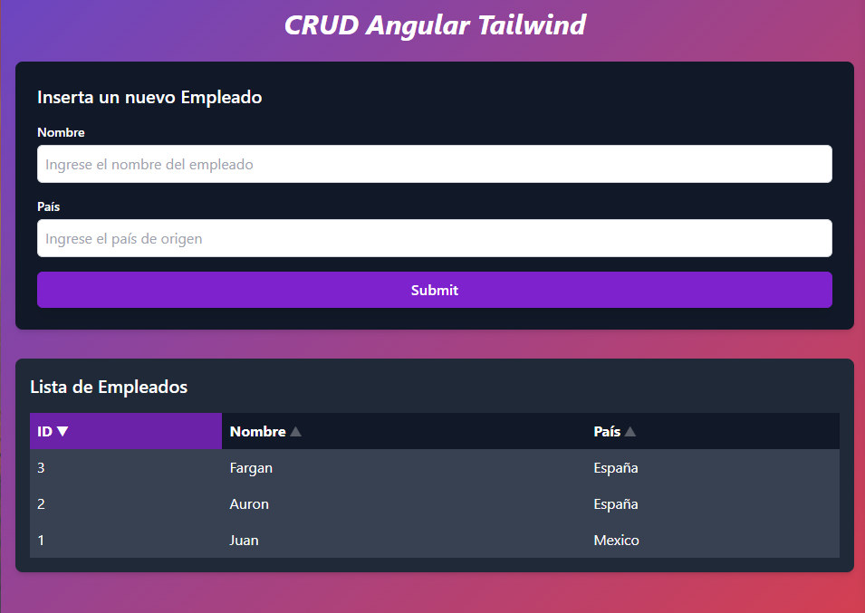
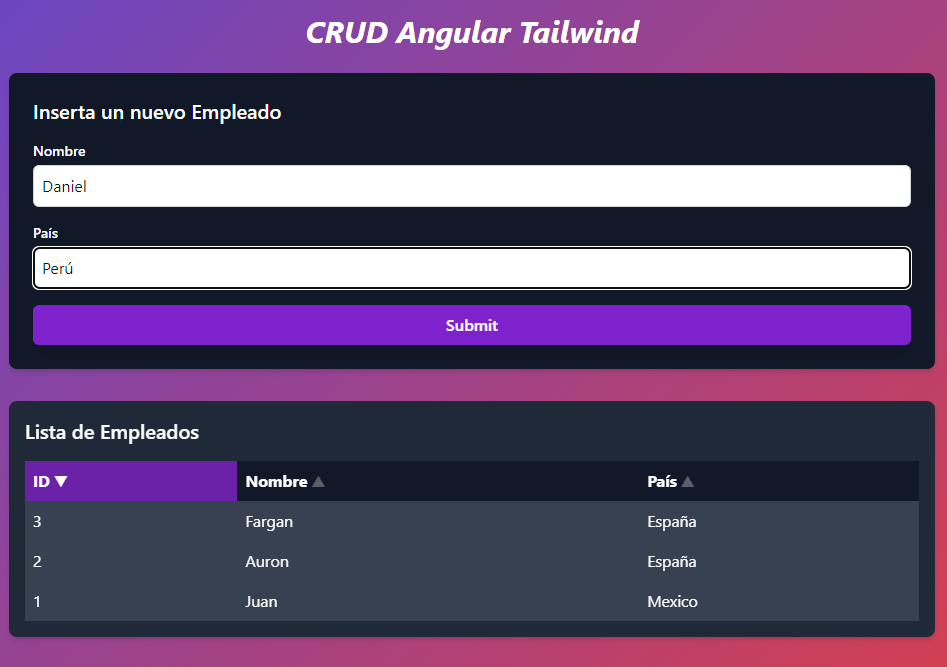
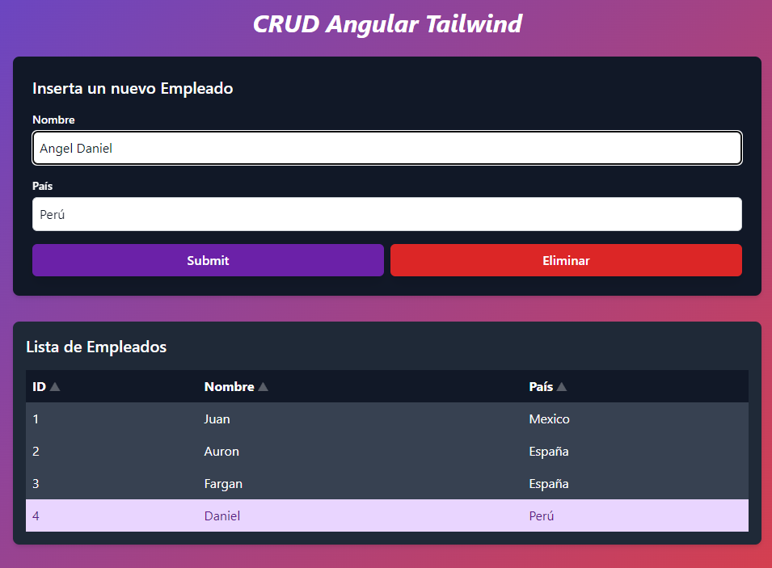
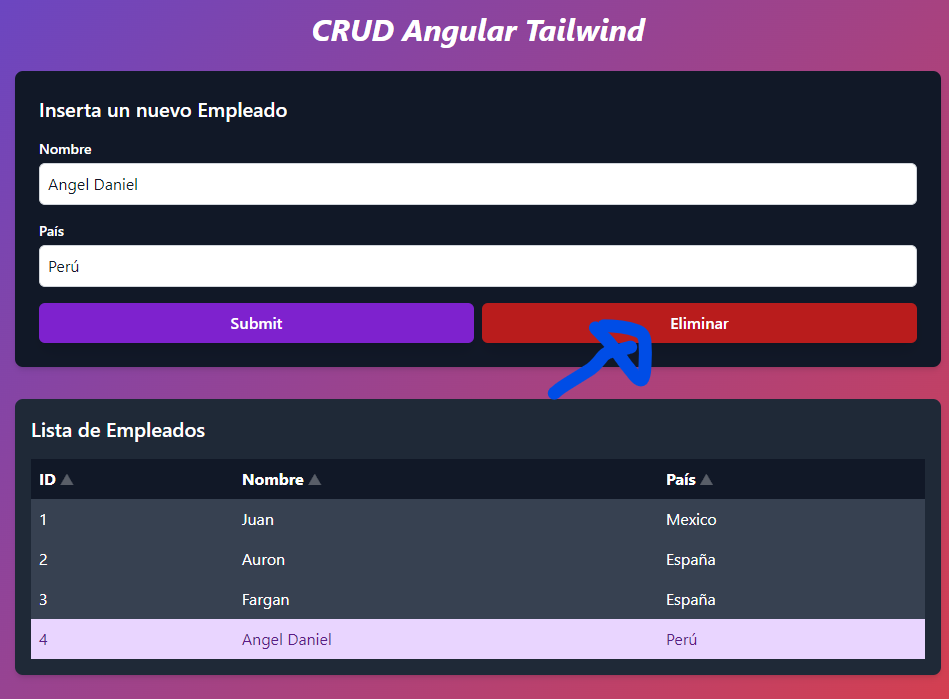
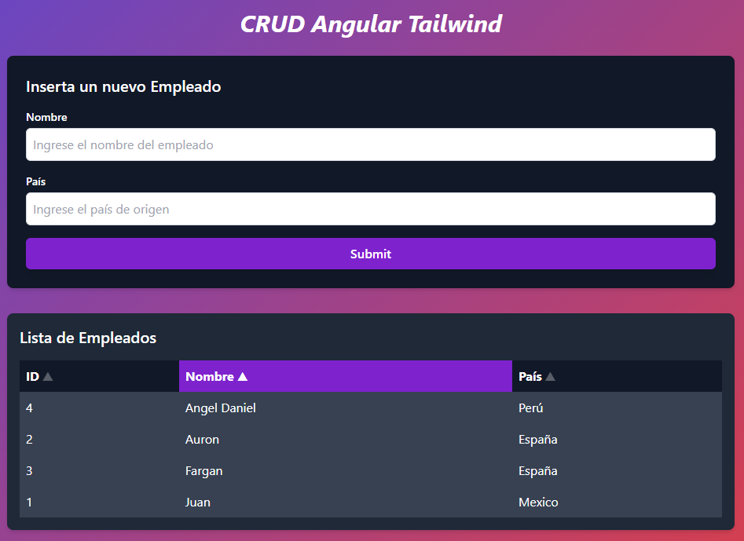

# CRUD de Empleados con Angular y Tailwind CSS



Este proyecto es una aplicación CRUD (Crear, Leer, Actualizar, Eliminar) simple pero potente para gestionar una lista de empleados. Está construida con Angular y estilizada con Tailwind CSS, ofreciendo una interfaz de usuario moderna y responsive.

## Características

- ✅ Agregar nuevos empleados
- 📝 Editar información de empleados existentes
- 🗑️ Eliminar empleados
- 🔍 Ver lista de empleados
- 🔢 Ordenar la lista por diferentes campos (ID, Nombre, País)
- 📱 Diseño responsive

## Tecnologías Utilizadas

- Angular 17
- Tailwind CSS
- TypeScript
- HTML5

## Instalación

1. Clona este repositorio:

```
git clone https://github.com/DanieluQC/CRUD-ejemplo.git
```

2. Navega al directorio del proyecto:

```
cd simple-crud
```

3. Instala las dependencias:

```
npm install
```

4. Inicia el servidor de desarrollo:

```
ng serve
```

5. Abre tu navegador y visita `http://localhost:4200/`

## Uso

### Agregar un Empleado



1. Completa los campos de Nombre y País en el formulario.
2. Haz clic en "Submit" para agregar el nuevo empleado.

### Editar un Empleado



1. Haz clic en la fila del empleado que deseas editar.
2. Modifica los campos en el formulario.
3. Haz clic en "Submit" para guardar los cambios.

### Eliminar un Empleado



1. Selecciona el empleado haciendo clic en su fila.
2. Haz clic en el botón "Eliminar".

### Ordenar la Lista



- Haz clic en los encabezados de las columnas para ordenar la lista.
- Un clic ordena de forma ascendente, un segundo clic ordena de forma descendente.
